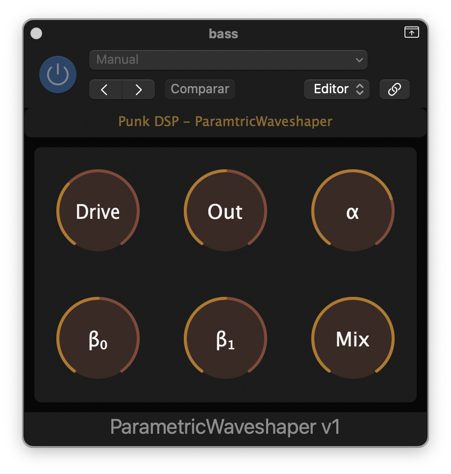
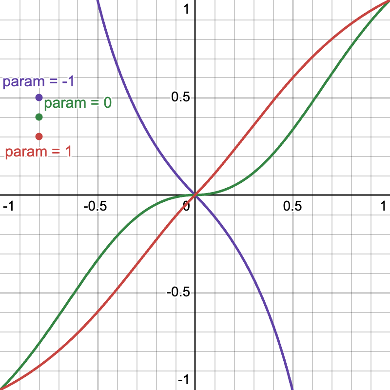

# PEWaveshaper

This is a VST3/AU waveshaper plugin made with [JUCE](https://juce.com/). The sole purpose of this plugin is to showcase and test the performance of my `ParametricWaveshaper` in conjunction with my `EnvelopeFollower` classes in [punk_dsp](https://github.com/gmoican/punk_dsp).

Shoutout to [THM Studio](https://thmstudio.com/blog/how-i-made-a-guitar-amp-plugin/) for his blog post; I am mostly copying his work.

## Introduction

The `ParametricWaveshaper` class implements a waveshaping algorithm characterized by a single parameter. In this repo, the `parameter` is adjusted by an envelope follower; check out [this repo](https://github.com/gmoican/ParametricWaveshaper) for an implementation where the `parameter` can be manipulated as a plugin parameter.

Check out the following picture to see the visual representation of how the `parameter` affects the waveshaping function:

## Features

- **Flexible processing**: Process individual samples or entire audio buffers.
- **Configurable parameters**:
    - `drive`: Input gain, modifies the waveshaper behaviour.
    - `outGain`: Output gain, intended to be used for compensating the volume difference.
    - `attack`: Adjust the attack time for the envelope follower.
    - `release`: Adjust the release time for the envelope follower.
    - `envelope_add`: Addition applied to the envelope value.
    - `envelope_mul`: Multiplier applied to the envelope value (after the addition).
    - `biasPre`: Bias introduced before applying `drive`, modifies the DC offset for asymmetric shaping.
    - `biasPost`: Bias introduced after applying `drive`, modifies the DC offset for asymmetric shaping.
    - `mix`: Blends the unprocessed and processed signals together.

## Plugins that make use of this parametric waveshaper
* [BassPreamp](https://github.com/gmoican/BassPreamp)
